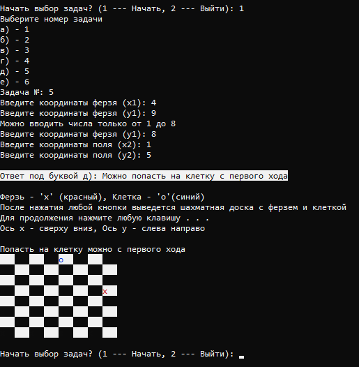

# #Chess
#
### О программе
программа решает 5 задач(данные в которых пользователь вводит сам) : 
а) выяснить являются ли поля одного цвета.
б)угрожает ли ферзь клетке.
в)угрожает ли конь клетке.
г)можно ли одним ходом ладьи попасть на клетку, если нет то как это сделать за 2 хода.
д)можно ли одним ходом ферзя попасть на клетку, если нет то как это сделать за 2 хода.
е)можно ли одним ходом слона попасть на клетку, если нет то как это сделать за 2 хода.
так же выводится шахматная доска, для более понятного вывода, на ней изображены символами обозначаемые клетки или нужные нам фигуры.
присутствуют проверки на введенные данные, например нельзя ввести 0 или 9, т.к. эти числа выходят за пределы доски.
на вопросы г-е задача может содержать несколько способов решения.
***
### О работе с программой
после запуска программы перед пользователем открывается меню, в котором предлагают начать пользование программой, а затем и выбор задачи.
после выбора задачи пользователь вводит данные, которые ему нужны, программа выводит результат.
***
### Информация о среде программирования и о запуске кода
среда программирования Visual Studio 2019.
программа скомпилируется в любой среде программирования, поддерживающей c++.
файл в проекте с кодом - 'Chess.cpp'
***
### Пример работы программы (Скриншоты)
 - меню и ввод данных в программу, задача 1 (буква а).
***
 - меню и ввод данных в программу, задача 2 (буква б).
***
 - меню и ввод данных в программу, задача 3 (буква в).
***
 - меню и ввод данных в программу, задача 4 (буква г).
***
 - меню и ввод данных в программу, задача 5 (буква д).(часть 1).

 - меню и ввод данных в программу, задача 5 (буква д).(часть 2).

 - меню и ввод данных в программу, задача 5 (буква д).(часть 3).
***
 - меню и ввод данных в программу, задача 6 (буква е).(часть 1).

 - меню и ввод данных в программу, задача 6 (буква е).(часть 2).

 - меню и ввод данных в программу, задача 6 (буква е).(часть 3).
***
 - выход из программы.
